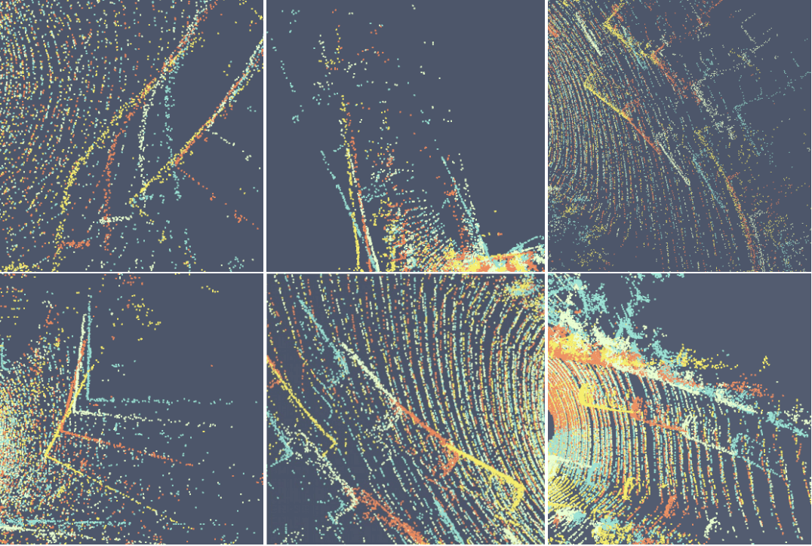

# NeuroGauss4D

**NeuroGauss4D-PCI: 4D Neural Fields and Gaussian Deformation Fields for Point Cloud Interpolation**   

Anonymous Author(s)

**meeting 2024**  


<!-- TABLE OF CONTENTS -->
<details open="open" style='padding: 10px; border-radius:5px 30px 30px 5px; border-style: solid; border-width: 1px;'>
  <summary>Table of Contents</summary>
  <ol>
    <li>
      <a href="#changelog">Changelog</a>
    </li>
    <li>
      <a href="#get-started">Get Started</a>
    </li>
    <li>
      <a href="#introduction">Introduction</a>
    </li>
    <li>
      <a href="#dataset">Dataset</a>
    </li>
    <li>
      <a href="#Evaluation results">Evaluation results</a>
    </li>
    <li>
      <a href="#visualization">Visualization</a>
    </li>
    <li>
      <a href="#license">License</a>
    </li>
  </ol>
</details>


## Changelog  
2024-5-22: ✨ 
We are pleased to announce that we have submitted NeuroGauss4D-PCI to meeting 2024. We extend our heartfelt thanks to all the reviewers for their valuable feedback.


## Get Started
## Installation
Please follow instructions to setup the environment.  
For the Conda environment, please refer to:
```
cd ./NeuroGauss4D/
conda create -n npci python=3.9
conda activate NeuroGauss4D

conda install pytorch==1.11.0 torchvision==0.12.0 torchaudio==0.11.0 cudatoolkit=11.3 -c pytorch -y

conda install -c open3d-admin open3d==0.9.0 -y
conda install -c conda-forge -c fvcore -c iopath fvcore iopath -y
conda install -c bottler nvidiacub -y
conda install pytorch3d -c pytorch3d -y

conda install pyg -c pyg -y
conda install -c conda-forge shapely -y

```

For Ubuntu environment configuration, please refer to Environment_info folder:
```
cd ./NeuroGauss4D/
pip install -r ./environment_info/requirements.txt
```

### compile cuda CD&EMD
```
cd ./utils/CD/chamfer3D/
python setup.py install

cd ../../EMD/
python setup.py install
cp build/lib.linux-x86_64-cpython-39/emd_cuda.cpython-39-x86_64-linux-gnu.so .
```
### compile point cloud utils
```
cd ../point_cloud_query/
python setup.py install

cd ../pointnet2/
python setup.py install
```

### Run NeuroGauss4D
Refer to [Dataset](#dataset) for data downloading first.  
Create a soft link to the dataset folder for DHB and NL-Drive.  
```
ln -s /PATH/TO/DHB ./data/DHB-dataset
ln -s /PATH/TO/NL_Drive ./data/NL_Drive
``` 

Make sure you are in the root directory of this repo.  

For DHB dataset, run
```
python main.py --dataset DHB --dataset_path ./data/DHB-dataset/DHB-dataset --scenes_list ./data/DHB_scene_list_test.txt --num_points 1024 --interval 4 --iters 6000 --lr 0.001 --layer_width 1280 --act_fn LeakyReLU --n_gaussians 16 --scheduler poly --Att_Fusion --NeuralField --T_RBF_GMM --Gaussians4D > ./log/DHB 2>&1 &
```

For NL-Drive dataset, run
```
python main.py  --dataset NL_Drive --dataset_path ./data/NL_Drive/NL-Drive/test/ --scenes_list ./data/NL_Drive/NL-Drive/test/scene_list/scene_list.txt --num_points 8192 --interval 4 --iters 6000 --lr 0.001 --layer_width 1280 --act_fn LeakyReLU --n_gaussians 16 --scheduler poly --NeuralField --T_RBF_GMM --Gaussians4D --Att_Fusion > ./log/Drive 2>&1 &
```

For KITTI_s Scene Flow dataset, run
```
python main.py  --dataset KITTI_s --dataset_path ./scene_flow/ --num_points 8192 --interval 4 --iters 6000 --lr 0.0005 --layer_width 1280 --act_fn LeakyReLU --n_gaussians 16 --scheduler poly --NeuralField --T_RBF_GMM --Gaussians4D --Att_Fusion --SceneFlow > ./log/KITTI_s 2>&1 &
```

For KITTI_o Scene Flow dataset, run
```
python main.py  --dataset KITTI_o --dataset_path ./kitti_rm_ground_KITTI_o/ --num_points 8192 --interval 4 --iters 6000 --lr 0.0005 --layer_width 1280 --act_fn LeakyReLU --n_gaussians 16 --scheduler poly --NeuralField --T_RBF_GMM --Gaussians4D --Att_Fusion --SceneFlow > ./log/KITTI_s 2>&1 &
```

## Introduction

This repository is the PyTorch implementation for **NeuroGauss4D**.  


Point Cloud Interpolation (PCI) confronts challenges from point sparsity, complex spatiotemporal dynamics, and the difficulty of deriving complete 3D point clouds from sparse temporal information. This paper presents NeuroGauss4D-PCI, which excels at modeling complex non-rigid deformations across varied dynamic scenes. The method begins with an iterative Gaussian cloud soft clustering module, offering structured temporal point cloud representations. The Temporal-RBF-GR module interpolates Gaussian parameters over time using Radial Basis Functions, enabling smooth parameter transitions and capturing temporal point cloud variations. Additionally, a 4D Gaussian deformation field module tracks the evolution of these parameters, creating continuous spatiotemporal deformation fields. A 4D neural field transforms low-dimensional spatiotemporal coordinates ($x,y,z,t$) into a high-dimensional latent space, representing point cloud motion across time and space. Integrating latent and explicit geometric features from the Gaussian field enhances temporal modeling accuracy.
NeuroGauss4D-PCI outperforms existing methods in point cloud frame interpolation, delivering leading performance on both object-level (DHB) and large-scale autonomous driving datasets (NL-Drive), with scalability to Auto-labeling and point cloud densification tasks.


## Dataset
## The current publicly available dataset
### 1. NL-Drive
  

Download link: [[OneDrive] ](https://tongjieducn-my.sharepoint.com/:f:/g/personal/zhengzehan_tongji_edu_cn/Ej4AiwgJWp1MsAFwtWcxIFkBPDwsCW_3bWSRlpYf4XZw-w) [[Google Drive (testset only)]](https://drive.google.com/file/d/1K3RftGU7UHwmX33NfHLSOgFQ3XkCbJat/view?usp=sharing)

NL-Drive dataset is a challenging multi-frame interpolation dataset for autonomous driving scenarios. Based on the principle of hard-sample selection and the diversity of scenarios, NL-Drive dataset contains point cloud sequences with large nonlinear movements from three public large-scale autonomous driving datasets: KITTI, Argoverse and Nuscenes.  


### 2. DHB

Download link: [[Google Drive] ](https://drive.google.com/drive/folders/1Oaras1mV6DOICMPkCggPZvnBAtc4SKgH?usp=sharing) 

Dynamic Human Bodies dataset (DHB), containing 10 point cloud sequences from the MITAMA dataset and 4 from the 8IVFB dataset. The sequences in DHB record 3D human motions with large and non-rigid deformation in real world. The overall dataset contains more than 3000 point cloud frames. And each frame has 1024 points.  

### 3. KITTI(HPLFlowNet without occlusion):

First, download the following parts:
Main data: [data_scene_flow.zip](https://s3.eu-central-1.amazonaws.com/avg-kitti/data_scene_flow.zip)
Calibration files: [data_scene_flow_calib.zip](https://s3.eu-central-1.amazonaws.com/avg-kitti/data_scene_flow_calib.zip)
Unzip them and organize the directory as follows:
```bash
datasets/KITTI_stereo2015
├── testing
│   ├── calib_cam_to_cam
│   ├── calib_imu_to_velo
│   ├── calib_velo_to_cam
│   ├── image_2
│   ├── image_3
└── training
    ├── calib_cam_to_cam
    ├── calib_imu_to_velo
    ├── calib_velo_to_cam
    ├── disp_noc_0
    ├── disp_noc_1
    ├── disp_occ_0
    ├── disp_occ_1
    ├── flow_noc
    ├── flow_occ
    ├── image_2
    ├── image_3
    ├── obj_map
```
Preprocess dataset using the following command:
```bash
cd utils
python process_kitti.py datasets/KITTI_stereo2015/ SAVE_PATH/KITTI_processed_occ_final
```

### 4. KITTI(FlowNet3D with occlusion):

The processed data is also provided [here](https://drive.google.com/open?id=1XBsF35wKY0rmaL7x7grD_evvKCAccbKi) for download


## Evaluation results  
### Quantitative comparison with open-source methods on DHB-Dataset. Errors are scaled by $\times 10^{-3}$ to emphasize small-scale differences in human body metrics. 
| Methods | Longdress (CD) | Longdress (EMD) | Loot (CD) | Loot (EMD) | Red&Black (CD) | Red&Black (EMD) | Soldier (CD) | Soldier (EMD) | Squat (CD) | Squat (EMD) | Swing (CD) | Swing (EMD) | Overall (CD) | Overall (EMD) | Param. |
|---------|-----------------|------------------|------------|------------|-----------------|------------------|---------------|----------------|-------------|-------------|-------------|--------------|---------------|----------------|--------|
| IDEA-Net [IDEA] | 0.89 | 6.01 | 0.86 | 8.62 | 0.94 | 10.34 | 1.63 | 30.07 | 0.62 | 6.68 | 1.24 | 6.93 | 1.02 | 12.03 | -- |
| PointINet [lu2021pointinet] | 0.98 | 10.87 | 0.85 | 12.10 | 0.87 | 10.68 | 0.97 | 12.39 | 0.90 | 13.99 | 1.45 | 14.81 | 0.96 | 12.25 | 1.30M |
| NSFP [li2021neural] | 1.04 | 7.45 | 0.81 | 7.13 | 0.97 | 8.14 | 0.68 | 5.25 | 1.14 | 7.97 | 3.09 | 11.39 | 1.22 | 7.81 | 0.12M |
| PV-RAFT [wei2021pv] | 1.03 | 6.88 | 0.82 | 5.99 | 0.94 | 7.03 | 0.91 | 5.31 | 0.57 | 2.81 | 1.42 | 10.54 | 0.92 | 6.14 | 0.11M |
| NeuralPCI [zheng2023neuralpci] | 0.70 | 4.36 | 0.61 | 4.76 | 0.67 | 4.79 | 0.59 | 4.63 | 0.03 | 0.02 | 0.53 | 2.22 | 0.54 | 3.68 | 1.85M |
| Ours | 0.68 | 3.69 | 0.59 | 4.12 | 0.65 | 4.20 | 0.57 | 4.14 | 0.00 | 0.00 | 0.00 | 0.00 | 0.42 | 2.69 | 0.10M |

### Quantitative comparison with other advanced methods on the NL Drive dataset. Frame-1, Frame-2, and Frame-3 denote three interpolated frames evenly spaced between two middle input frames. The symbol "^" signifies outlier removal during preprocessing.
| Methods | Type | Frame-1 (CD) | Frame-1 (EMD) | Frame-2 (CD) | Frame-2 (EMD) | Frame-3 (CD) | Frame-3 (EMD) | Average (CD) | Average (EMD) |
|---------|------|---------------|----------------|---------------|----------------|---------------|----------------|---------------|----------------|
| NSFP [li2021neural] | Forward Flow | 0.94 | 95.18 | 1.75 | 132.30 | 2.55 | 168.91 | 1.75 | 132.13 |
| NSFP [li2021neural] | Backward Flow | 2.53 | 168.75 | 1.74 | 132.19 | 0.95 | 95.23 | 1.74 | 132.05 |
| PV-RAFT [wei2021pv] | Forward Flow | 1.36 | 104.57 | 1.92 | 146.87 | 1.63 | 169.82 | 1.64 | 140.42 |
| PV-RAFT [wei2021pv] | Backward Flow | 1.58 | 173.18 | 1.85 | 145.48 | 1.30 | 102.71 | 1.58 | 140.46 |
| PointINet [lu2021pointinet] | Bi-directional Flow | 0.93 | 97.48 | 1.24 | 110.22 | 1.01 | 95.65 | 1.06 | 101.12 |
| NeuralPCI [zheng2023neuralpci] | Neural Field | 0.72 | 89.03 | 0.94 | 113.45 | 0.74 | 88.61 | 0.80 | 97.03 |
| Ours | 4D Gauss. Deformation | 0.70 | 86.90 | 0.93 | 112.1 | 0.72 | 88.85 | 0.78 | 95.95 |
| Ours^ | 4D Gauss. Deformation | 0.64 | 71.92 | 0.88 | 91.9 | 0.65 | 72.16 | 0.72 | 78.66 |

<!-- ## Acknowledgements -->


## License

  All code within this repository is under [Apache License 2.0](https://www.apache.org/licenses/LICENSE-2.0).
